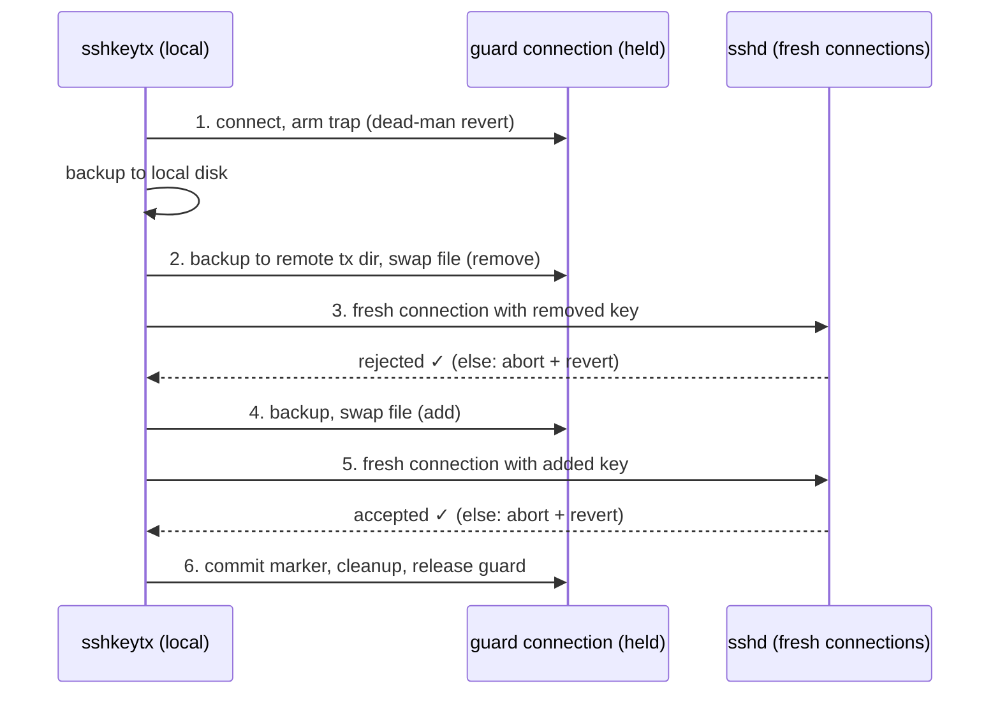

# sshkeytx

Transactional, lockout-safe `authorized_keys` changes over SSH.

Rotating or revoking SSH keys by editing `authorized_keys` has a canonical failure mode: the old key is gone, the new key doesn't work, and the host is unreachable. Configuration tools converge a file and leave; none of them can express the thing that actually prevents lockout — *hold a working connection open across the change and prove the new state with fresh connections before letting go*.

sshkeytx does exactly that. Every run is one transaction:

1. **connect** — open a guard connection and hold it for the whole transaction; arm a dead-man trap on the remote before anything is touched
2. **remove keys** — copy-and-swap: the file is backed up to **two locations** (remote transaction dir + local disk), then atomically replaced
3. **verify removal** — a **fresh connection** with each removed key must be *rejected*
4. **add keys** — copy-and-swap again
5. **verify addition** — a **fresh connection** with each added key must be *accepted*
6. **cleanup** — disarm the trap, remove the remote transaction dir, release the guard; local backups are kept

Any failure at any step aborts the transaction: every touched file is reverted to its pre-transaction content and the revert is verified byte-for-byte. If the process or the connection dies instead, the remote trap performs the same revert on its own.

Multiple keys and multiple users fold into the same single transaction.

## Install

```sh
go install github.com/caoer/sshkeytx@latest
```

Or build a static binary:

```sh
CGO_ENABLED=0 go build -o sshkeytx .
```

The remote host needs only sshd and a POSIX `sh` — no agent, no runtime, nothing to install remotely.

## Usage

Rotate your own key (the guard rides the key being removed — that's fine, that's the point):

```sh
sshkeytx apply --target root@host \
  --remove root=SHA256:PIhU2LxG3u... \
  --add root=./new_key.pub \
  --verify-identity ./new_key
```

Revoke someone else's key for several users and provision a replacement, one transaction:

```sh
sshkeytx apply --target root@host \
  --remove alice=./departed.pub \
  --remove root=./departed.pub \
  --add alice='ssh-ed25519 AAAAC3... alice@new-laptop'
```

Audit without changing anything:

```sh
sshkeytx check --target root@host \
  --present root=./expected.pub \
  --absent  root=SHA256:revokedFingerprint...
```

Ask a live server whether a key would be accepted — no private key needed:

```sh
sshkeytx probe --target root@host alice=./somebody.pub
```

Preview a transaction:

```sh
sshkeytx apply --target root@host --remove root=./old.pub --add root=./new.pub --dry-run
```

Break-glass: re-apply the local pre-transaction backups from an earlier run:

```sh
sshkeytx restore --target root@host --from ~/.local/state/sshkeytx/20260818T190412Z-ab12cd34
```

Key arguments are `user=KEY` where `KEY` is a `.pub` file path, a literal `ssh-ed25519 AAAA...` line, or a `SHA256:...` fingerprint (fingerprints can match for removal/audit, but cannot be added or probed — only real key material can).

Non-standard layouts use `--path` (`%u` = username, `%h` = home):

```sh
sshkeytx apply --target root@host --path '/etc/ssh/authorized_keys.d/%u' ...
```

## How the safety works



- **The guard connection is the safety line.** It authenticates once, before anything changes, and every remote command of the transaction runs through it — a broken connection can never be papered over by a silent reconnect. Connection health is re-checked before every phase.
- **The remote trap is the dead-man switch.** A held session runs a POSIX `sh` trap armed *before* the first write: if the session ends without a commit marker — process crash, connection drop, sshd shutdown — it restores every manifested file from its remote backup copy. Restores are content-overwrites (`cat backup > target`), preserving inode, owner, and mode.
- **Copy-and-swap, two copies.** Before a file is first modified, its pre-transaction content is saved locally (`~/.local/state/sshkeytx/<txid>/`, kept forever) and remotely (transaction dir, feeding the trap). Writes are sibling-tempfile + `mv` — atomic on the same filesystem — with owner and mode preserved.
- **Verification is live, not a file diff.** Removed keys are checked with the SSH publickey *query* phase (RFC 4252 §7): the probe offers the public key and the server answers whether it is authorized **before any signature is required** — so a revoked key is proven rejected even when its private half belongs to someone else. Added keys verify the same way, or by full authentication when you hold the private key (`--verify-identity`, or automatically when it's in your ssh-agent).
- **Aborts revert and verify the revert.** Explicit revert first, read back and compared byte-for-byte (exit 1). If the connection is too dead to revert explicitly, the guard is dropped *without* the commit marker so the remote trap reverts server-side (exit 3, with backup paths printed).

## Exit codes

| Code | Meaning |
|---|---|
| 0 | committed (or check/probe passed) |
| 1 | transaction aborted, revert **verified** (or check/probe found violations) |
| 2 | usage error |
| 3 | aborted, revert **unverified** — remote trap is the backstop; backups printed |
| 4 | failed before any write (connect, auth, lookup) |

## Limitations

Honest ones:

- **Per-host transaction.** There is no two-phase commit across a fleet; run one transaction per host and let your orchestration handle the loop. Within a host, any mix of users and keys is one transaction.
- **The dead-man trap fires when sshd reaps the session.** On process death or a closed TCP connection that is immediate; on a silent network partition it waits for the server's TCP/keepalive timeouts. The primary revert path is always the explicit one.
- **Editing other users' files needs root** (or write permission on their files). The guard user is the `--target` user.
- **Remote needs POSIX `sh`** on the exec path (bash, dash, ash, zsh all qualify; a root shell of fish does not).
- **NixOS-style managed hosts:** if `authorized_keys` is generated by configuration management, a rebuild will revert whatever sshkeytx changed. Point sshkeytx at the mutable path sshd actually consults, or feed your generator instead.

## Development

```sh
go test ./...        # includes integration tests against an in-process SSH server
go test -race ./...
```

The integration tests run a real publickey-authenticating SSH server, execute the transaction against it, and assert the verify verdicts, the revert-on-failure path, and the dead-man trap (connection killed mid-transaction, file restored by the remote trap alone).

## License

MIT
